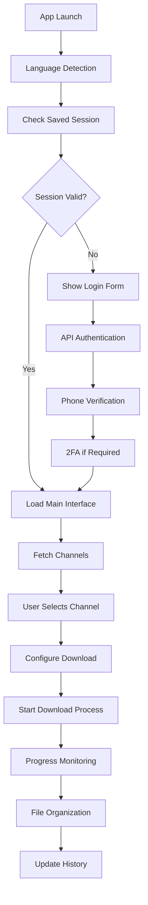

# 🔧 Developer Guide

This guide covers everything you need to know for developing, building, and contributing to the Telegram Channel Downloader project.

## 📑 Table of Contents

1. [Development Setup](#development-setup)
2. [Project Architecture](#project-architecture)
3. [Building and Testing](#building-and-testing)
4. [Code Structure](#code-structure)
5. [API Integration](#api-integration)
6. [Internationalization](#internationalization)
7. [Contributing Guidelines](#contributing-guidelines)
8. [Release Process](#release-process)

## 🚀 Development Setup

### Prerequisites

- **Node.js**: Version 18.x or higher
- **pnpm**: Recommended package manager (or npm/yarn)
- **Git**: For version control
- **Code Editor**: VS Code recommended with Vue/Vite extensions

### Environment Setup

1. **Clone Repository**
   ```bash
   git clone https://github.com/yourusername/telegram-channel-downloader.git
   cd telegram-channel-downloader
   ```

2. **Install Dependencies**
   ```bash
   pnpm install
   ```

3. **Development Scripts**
   ```bash
   # Start development server (Vue + Electron)
   pnpm dev
   
   # Start only Vue dev server
   pnpm dev:vite
   
   # Start only Electron (requires Vite to be running)
   pnpm dev:electron
   
   # Build for production
   pnpm build
   
   # Package for current platform
   pnpm electron:pack
   
   # Create distribution packages
   pnpm electron:dist
   ```

### IDE Configuration

#### VS Code Extensions
- **Vetur** or **Vue Language Features (Volar)**: Vue 3 support
- **ESLint**: Code linting
- **Prettier**: Code formatting
- **Auto Rename Tag**: HTML tag renaming
- **Bracket Pair Colorizer**: Better bracket visualization

#### VS Code Settings
```json
{
  "editor.formatOnSave": true,
  "editor.codeActionsOnSave": {
    "source.fixAll.eslint": true
  },
  "vetur.validation.template": false,
  "typescript.preferences.includePackageJsonAutoImports": "auto"
}
```

## 🏗️ Project Architecture

### Technology Stack

```
┌─────────────────────────────────────────┐
│                Frontend                 │
│  Vue 3 + Composition API + TypeScript  │
│        Vuetify 3 + Material Design     │
│              Pinia (State)              │
│             Vue I18n (i18n)             │
└─────────────────────────────────────────┘
                      │
┌─────────────────────────────────────────┐
│               Electron                  │
│     Main Process + Renderer Process     │
│         IPC Communication              │
│        File System Access              │
└─────────────────────────────────────────┘
                      │
┌─────────────────────────────────────────┐
│            Telegram API                 │
│         telegram.js Library             │
│       WebSocket + HTTP Calls            │
└─────────────────────────────────────────┘
```

### Application Flow



### Directory Structure

```
src/
├── components/           # Vue components
│   ├── DownloadManager.vue    # Main download interface
│   ├── TelegramLogin.vue      # Authentication flow
│   ├── LanguageSelector.vue   # Language switcher
│   └── ...
├── services/            # Business logic
│   ├── telegramService.js     # Telegram API wrapper
│   ├── downloadService.js     # Download management
│   └── ...
├── stores/              # Pinia state management
│   ├── telegram.js           # Telegram session state
│   ├── download.js           # Download state
│   └── ...
├── i18n/                # Internationalization
│   ├── index.js              # i18n configuration
│   └── locales/              # Language files
│       ├── en.json
│       ├── zh-CN.json
│       └── ...
├── utils/               # Utility functions
│   ├── electronAPI.js        # Electron IPC helpers
│   └── ...
├── config/              # Configuration files
│   ├── telegram.js           # Telegram API config
│   ├── vuetify.js           # Vuetify config
│   └── ...
├── assets/              # Static assets
├── App.vue              # Root component
└── main.js              # Application entry point
```

## 🔨 Building and Testing

### Development Build

```bash
# Development with hot reload
pnpm dev

# Build Vue app only
pnpm build:vite

# Package Electron app
pnpm electron:pack
```

### Production Build

```bash
# Full production build
pnpm build

# Platform-specific builds
pnpm build:win     # Windows
pnpm build:mac     # macOS  
pnpm build:linux   # Linux
```

### Testing

```bash
# Run unit tests
pnpm test

# Run E2E tests
pnpm test:e2e

# Test coverage
pnpm test:coverage
```

### Build Configuration

#### Electron Builder Config (`package.json`)
```json
{
  "build": {
    "appId": "com.electron.telegram-downloader",
    "productName": "Telegram Channel Downloader",
    "directories": {
      "buildResources": "build",
      "output": "dist-electron"
    },
    "files": [
      "dist/**/*",
      "electron/**/*",
      "node_modules/**/*"
    ],
    "mac": {
      "icon": "build/icon.icns",
      "category": "public.app-category.utilities"
    },
    "win": {
      "icon": "build/icon.ico",
      "target": "nsis"
    },
    "linux": {
      "icon": "build/icon.png",
      "category": "Utility"
    }
  }
}
```

## 📋 Code Structure

### Vue Components

#### Component Architecture
```vue
<template>
  <!-- Template with Vuetify components -->
  <v-container>
    <v-row>
      <v-col>
        <!-- Component content -->
      </v-col>
    </v-row>
  </v-container>
</template>

<script setup>
import { ref, computed, onMounted } from 'vue'
import { useI18n } from 'vue-i18n'
import { useStore } from 'pinia'

// Composition API setup
const { t } = useI18n()
const store = useStore()

// Reactive data
const data = ref(null)
const loading = ref(false)

// Computed properties
const computedValue = computed(() => {
  return data.value ? data.value.transformed : null
})

// Methods
const handleAction = async () => {
  loading.value = true
  try {
    // Handle action
  } finally {
    loading.value = false
  }
}

// Lifecycle
onMounted(() => {
  // Component initialization
})
</script>

<style scoped>
/* Component-specific styles */
</style>
```

### State Management (Pinia)

#### Store Structure
```javascript
import { defineStore } from 'pinia'

export const useTelegramStore = defineStore('telegram', {
  state: () => ({
    isConnected: false,
    apiCredentials: null,
    sessionToken: null,
    userInfo: null,
    dialogs: []
  }),

  getters: {
    isAuthenticated: (state) => {
      return state.isConnected && state.sessionToken
    },
    
    channelCount: (state) => {
      return state.dialogs.filter(d => d.isChannel).length
    }
  },

  actions: {
    async connect(credentials) {
      try {
        // Connect to Telegram API
        this.apiCredentials = credentials
        this.isConnected = true
      } catch (error) {
        console.error('Connection failed:', error)
        throw error
      }
    },

    async logout() {
      this.isConnected = false
      this.sessionToken = null
      this.userInfo = null
      this.dialogs = []
    }
  }
})
```

### Service Layer

#### Service Pattern
```javascript
class TelegramService {
  constructor() {
    this.client = null
    this.isConnected = false
  }

  async connect(apiId, apiHash) {
    try {
      // Initialize Telegram client
      this.client = new TelegramClient(/* config */)
      await this.client.connect()
      this.isConnected = true
      return true
    } catch (error) {
      console.error('Telegram connection failed:', error)
      throw error
    }
  }

  async getDialogs() {
    if (!this.isConnected) {
      throw new Error('Not connected to Telegram')
    }
    
    try {
      const dialogs = await this.client.getDialogs()
      return dialogs.map(this.transformDialog)
    } catch (error) {
      console.error('Failed to fetch dialogs:', error)
      throw error
    }
  }

  transformDialog(dialog) {
    return {
      id: dialog.id,
      title: dialog.title || dialog.name,
      isChannel: dialog.isChannel,
      isGroup: dialog.isGroup,
      // ... other properties
    }
  }
}

export default new TelegramService()
```

## 🔌 API Integration

### Telegram API Setup

#### Client Configuration
```javascript
import { TelegramClient } from 'telegram'
import { StringSession } from 'telegram/sessions'

const session = new StringSession(savedSessionString)
const client = new TelegramClient(session, apiId, apiHash, {
  connectionRetries: 5,
  retryDelay: 1000,
  autoReconnect: true,
  timeout: 10000
})
```

#### Authentication Flow
```javascript
async function authenticate(apiId, apiHash, phoneNumber) {
  const client = new TelegramClient(new StringSession(''), apiId, apiHash)
  
  await client.start({
    phoneNumber: async () => phoneNumber,
    phoneCode: async () => await promptForCode(),
    password: async () => await promptForPassword(),
    onError: (err) => console.error('Auth error:', err),
  })
  
  return client.session.save()
}
```

#### Download Implementation
```javascript
async function downloadMedia(message, downloadPath) {
  try {
    const media = message.media
    if (!media) return null

    const buffer = await client.downloadMedia(media, {
      progressCallback: (progress) => {
        // Update progress UI
        updateProgress(progress.downloaded, progress.total)
      }
    })

    const filename = generateFilename(message, media)
    const filepath = path.join(downloadPath, filename)
    
    await fs.writeFile(filepath, buffer)
    return filepath
  } catch (error) {
    console.error('Download failed:', error)
    throw error
  }
}
```

### Error Handling

```javascript
class APIError extends Error {
  constructor(message, code, details) {
    super(message)
    this.name = 'APIError'
    this.code = code
    this.details = details
  }
}

const handleTelegramError = (error) => {
  if (error.code === 'PHONE_NUMBER_INVALID') {
    throw new APIError('Invalid phone number format', 'PHONE_INVALID', error)
  }
  
  if (error.code === 'SESSION_PASSWORD_NEEDED') {
    throw new APIError('Two-factor authentication required', '2FA_REQUIRED', error)
  }
  
  // Generic error handling
  throw new APIError('Telegram API error', 'API_ERROR', error)
}
```

## 🌍 Internationalization

### Setup and Configuration

#### i18n Setup (`src/i18n/index.js`)
```javascript
import { createI18n } from 'vue-i18n'

// Language detection logic
const detectLanguage = () => {
  const stored = localStorage.getItem('user-language')
  if (stored) return stored
  
  const browser = navigator.language.toLowerCase()
  
  // Handle Chinese variants
  if (browser.includes('zh')) {
    if (browser.includes('tw') || browser.includes('hk') || browser.includes('hant')) {
      return 'zh-TW'
    }
    return 'zh-CN'
  }
  
  // Map browser codes to supported languages
  const langMap = {
    'ja': 'ja',
    'ko': 'ko', 
    'fr': 'fr',
    'de': 'de',
    'es': 'es'
  }
  
  return langMap[browser.split('-')[0]] || 'en'
}

const i18n = createI18n({
  locale: detectLanguage(),
  fallbackLocale: 'zh-CN',
  legacy: false,
  globalInjection: true,
  messages: {
    // Language files imported dynamically
  }
})
```

### Language File Structure

#### Translation Keys Organization
```json
{
  "app": {
    "title": "Telegram Channel Downloader",
    "description": "Download Telegram channel content"
  },
  "nav": {
    "login": "Login",
    "download": "Download Manager"
  },
  "login": {
    "title": "Telegram Login",
    "apiConfig": "API Configuration",
    "errors": {
      "apiIdRequired": "API ID is required",
      "phoneRequired": "Phone number is required"
    }
  },
  "download": {
    "title": "Download Configuration",
    "types": {
      "images": "Images",
      "videos": "Videos"
    },
    "progress": {
      "downloading": "Downloading",
      "completed": "Completed"
    }
  }
}
```

### Adding New Languages

1. **Create Language File**
   ```bash
   cp src/i18n/locales/en.json src/i18n/locales/[new-lang].json
   ```

2. **Translate Content**
   - Update all translation keys in the new file
   - Maintain the same structure as the English file

3. **Update Language Detection**
   ```javascript
   // Add to detectLanguage() function
   const langMap = {
     'ja': 'ja',
     'ko': 'ko',
     'fr': 'fr',
     'de': 'de',
     'es': 'es',
     'pt': 'pt', // New language
   }
   ```

4. **Update Language Selector**
   ```javascript
   const supportedLanguages = [
     { code: 'en', name: 'English' },
     { code: 'zh-CN', name: '简体中文' },
     // Add new language
     { code: 'pt', name: 'Português' }
   ]
   ```

## 🤝 Contributing Guidelines

### Code Style

#### Vue Style Guide
- Follow [Vue.js Style Guide](https://vuejs.org/style-guide/)
- Use Composition API over Options API
- Prefer `<script setup>` syntax
- Use TypeScript for type safety

#### JavaScript/TypeScript
```javascript
// Use arrow functions for callbacks
const items = data.map(item => transform(item))

// Use template literals for strings
const message = `Welcome ${user.name}!`

// Use destructuring
const { name, email } = user
const [first, ...rest] = items

// Use async/await over Promises
async function fetchData() {
  try {
    const response = await api.getData()
    return response.data
  } catch (error) {
    console.error('Failed to fetch data:', error)
    throw error
  }
}
```

#### CSS/SCSS
```scss
// Use CSS custom properties
.component {
  --primary-color: #1976d2;
  color: var(--primary-color);
}

// Use BEM methodology for custom styles
.download-manager {
  &__header {
    display: flex;
    align-items: center;
  }
  
  &__content {
    padding: 16px;
  }
}

// Prefer Vuetify utilities over custom CSS
<v-btn color="primary" variant="elevated">
  Button Text
</v-btn>
```

### Git Workflow

#### Branch Naming
```bash
# Feature branches
feature/add-download-resume
feature/improve-ui-responsiveness

# Bug fix branches
fix/authentication-error
fix/download-progress-accuracy

# Documentation branches
docs/update-user-guide
docs/add-api-documentation
```

#### Commit Messages
```bash
# Format: type(scope): description

feat(download): add resume download functionality
fix(auth): resolve 2FA authentication issue
docs(readme): update installation instructions
style(ui): improve button spacing and alignment
refactor(services): extract common API logic
test(download): add unit tests for download service
```

#### Pull Request Template
```markdown
## Description
Brief description of changes

## Type of Change
- [ ] Bug fix
- [ ] New feature
- [ ] Documentation update
- [ ] Performance improvement
- [ ] Code refactoring

## Testing
- [ ] Unit tests pass
- [ ] E2E tests pass
- [ ] Manual testing completed

## Screenshots (if applicable)
[Add screenshots of UI changes]

## Checklist
- [ ] Code follows style guidelines
- [ ] Self-review completed
- [ ] Documentation updated
- [ ] No breaking changes
```

### Testing Strategy

#### Unit Tests
```javascript
import { describe, it, expect, vi } from 'vitest'
import { mount } from '@vue/test-utils'
import DownloadManager from '@/components/DownloadManager.vue'

describe('DownloadManager', () => {
  it('renders download configuration form', () => {
    const wrapper = mount(DownloadManager)
    expect(wrapper.find('.download-config').exists()).toBe(true)
  })

  it('validates required fields', async () => {
    const wrapper = mount(DownloadManager)
    await wrapper.find('.submit-btn').trigger('click')
    expect(wrapper.find('.error-message').exists()).toBe(true)
  })
})
```

#### Integration Tests
```javascript
import { test, expect } from '@playwright/test'

test('complete download flow', async ({ page }) => {
  await page.goto('http://localhost:5173')
  
  // Login
  await page.fill('[data-testid="api-id"]', 'test-api-id')
  await page.fill('[data-testid="api-hash"]', 'test-api-hash')
  await page.click('[data-testid="connect-btn"]')
  
  // Configure download
  await page.click('[data-testid="channel-item"]')
  await page.click('[data-testid="type-images"]')
  await page.click('[data-testid="start-download"]')
  
  // Verify progress dialog
  await expect(page.locator('[data-testid="progress-dialog"]')).toBeVisible()
})
```

## 🚀 Release Process

### Version Management

#### Semantic Versioning
- **Major** (x.0.0): Breaking changes
- **Minor** (x.y.0): New features, backwards compatible
- **Patch** (x.y.z): Bug fixes, backwards compatible

#### Release Checklist
1. **Pre-release**
   - [ ] All tests pass
   - [ ] Documentation updated
   - [ ] Version bumped in `package.json`
   - [ ] Changelog updated

2. **Build and Test**
   ```bash
   # Build for all platforms
   pnpm build:all
   
   # Test builds
   pnpm test:builds
   ```

3. **Create Release**
   ```bash
   # Tag version
   git tag v1.2.3
   git push origin v1.2.3
   
   # GitHub release
   gh release create v1.2.3 ./dist-electron/*
   ```

### Automated CI/CD

#### GitHub Actions Workflow
```yaml
name: Build and Release

on:
  push:
    tags: ['v*']

jobs:
  build:
    strategy:
      matrix:
        os: [ubuntu-latest, windows-latest, macos-latest]
    
    runs-on: ${{ matrix.os }}
    
    steps:
      - uses: actions/checkout@v3
      - uses: actions/setup-node@v3
        with:
          node-version: 18
          cache: 'pnpm'
      
      - run: pnpm install
      - run: pnpm test
      - run: pnpm build
      
      - uses: actions/upload-artifact@v3
        with:
          name: dist-${{ matrix.os }}
          path: dist-electron/
```

---

For questions about development, join our [Discord](https://discord.gg/telegram-downloader) or open a [GitHub Discussion](https://github.com/yourusername/telegram-channel-downloader/discussions). 