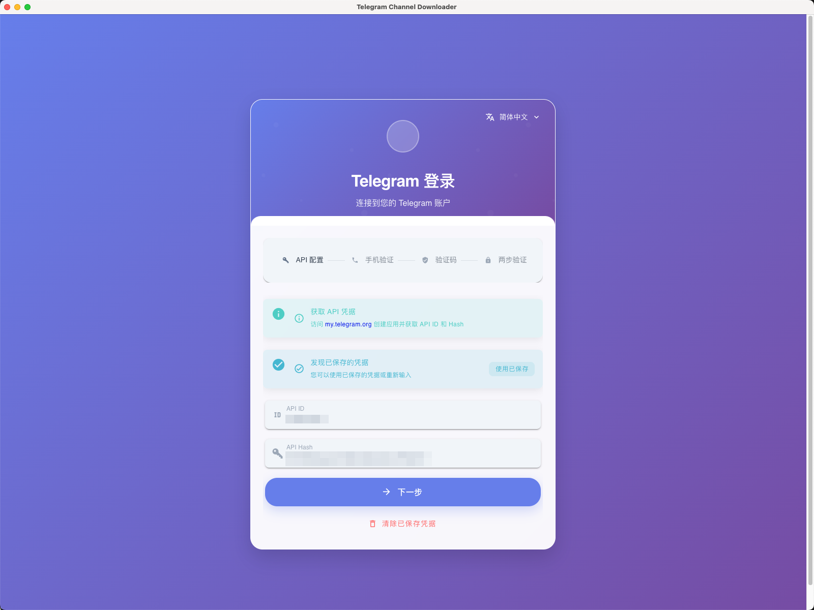
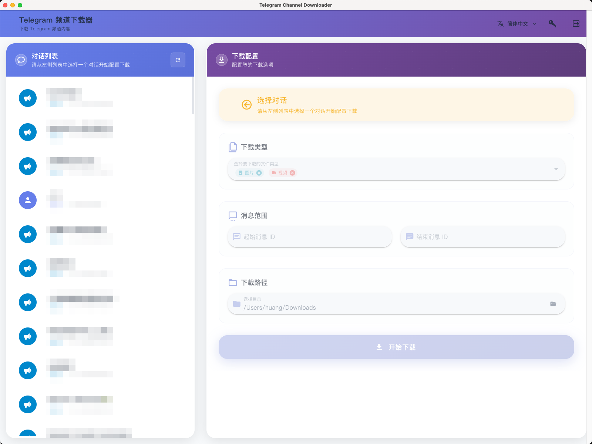
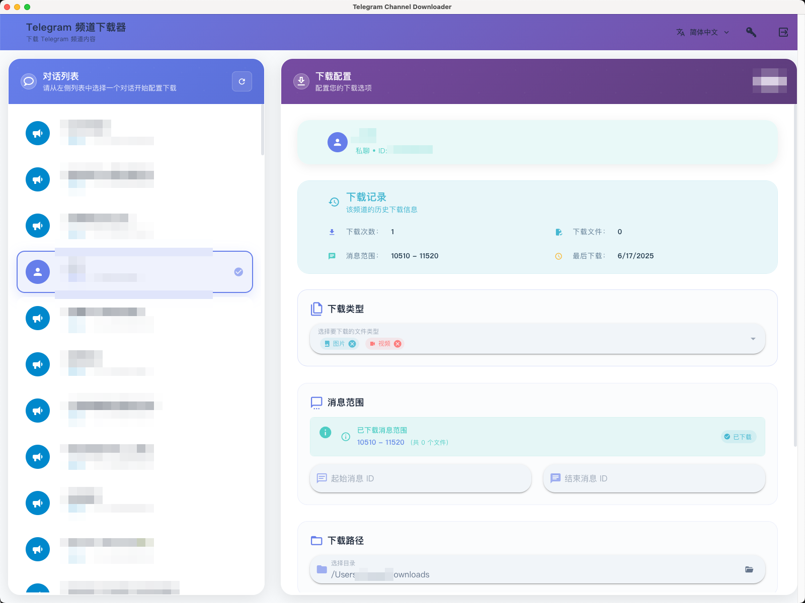
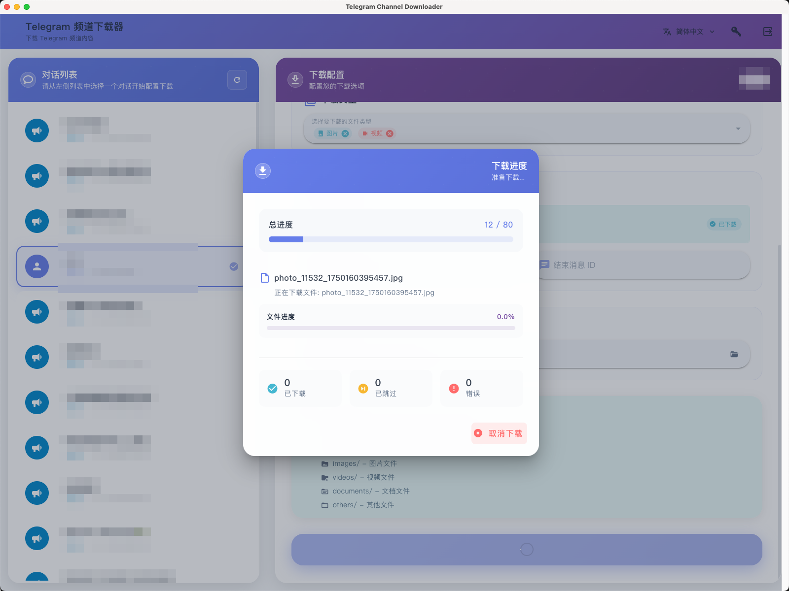

# 📥 Telegram 频道下载器

<div align="center">


**一个基于 Electron 和 Vue 3 构建的强大跨平台 Telegram 频道内容下载工具**

[](https://opensource.org/licenses/MIT)
[](https://electronjs.org/)
[](https://vuejs.org/)
[]()

📞 **联系开发者**: [@oooooh_hooooo](https://t.me/oooooh_hooooo)

[English](../README.md) • [简体中文](README.zh-CN.md)

</div>

## ✨ 功能特性

- 🔐 **安全认证**: 官方 Telegram API 登录，支持手机验证
- 🌍 **多语言支持**: 8 种语言（英语、简中、繁中、日语、韩语、法语、德语、西语）
- 📱 **双重验证**: 支持两步验证密码保护
- 📋 **频道管理**: 浏览和选择所有可访问的频道/群组
- 📥 **批量下载**: 批量下载媒体文件和消息
- 🎯 **内容筛选**: 按媒体类型筛选（图片、视频、文档、其他）
- 📏 **文件大小过滤**: 按最小/最大文件大小（KB）精确控制下载
- 🔍 **文件名过滤**: 基于文件名模式包含或排除文件
- 📊 **实时进度**: 实时下载进度和详细统计
- 💾 **数据导出**: 将消息数据导出为结构化 JSON 文件
- 🎨 **现代界面**: Material Design 3 响应式布局
- 🌙 **主题支持**: 明暗主题模式
- 📱 **跨平台**: 支持 Windows、macOS 和 Linux
- 🔄 **断点续传**: 继续中断的下载
- 📈 **下载历史**: 跟踪下载会话和统计信息

## 🖼️ 应用截图

<div align="center">

### 登录界面


### 主界面


### 下载配置


### 下载进度


</div>

## 🛠️ 技术栈

- **框架**: Electron 28+
- **前端**: Vue 3 + Composition API + TypeScript
- **UI 库**: Vuetify 3 + Material Design 3
- **状态管理**: Pinia
- **构建工具**: Vite 6
- **包管理器**: pnpm（推荐）
- **Telegram API**: telegram.js（Web 版本）
- **国际化**: Vue I18n

## 🚀 快速开始

### 前置要求

- Node.js 18+
- pnpm（推荐）或 npm/yarn
- Telegram API 凭据（请参阅[获取 API 凭据](#-获取-telegram-api-凭据)）

### 安装

```bash
# 克隆仓库
git clone https://github.com/yourusername/telegram-channel-downloader.git
cd telegram-channel-downloader

# 安装依赖
pnpm install

# 启动开发服务器
pnpm dev
```

### 生产构建

```bash
# 构建并打包当前平台
pnpm build

# 构建特定平台
pnpm build:win    # Windows
pnpm build:mac    # macOS
pnpm build:linux  # Linux
```

## 🔑 获取 Telegram API 凭据

1. 访问 [my.telegram.org](https://my.telegram.org)
2. 使用手机号登录
3. 进入 "API development tools"
4. 创建新的应用程序
5. 复制你的 `API ID` 和 `API Hash`

**重要提示**: 请妥善保管你的 API 凭据，不要公开分享。

## 📚 文档

- [📖 用户指南](USER_GUIDE.md) - 详细使用说明
- [🔧 开发者指南](DEVELOPER_GUIDE.md) - 设置和开发
- [🌍 国际化](I18N.md) - 多语言支持
- [❓ 常见问题](FAQ.md) - 常见问题解答
- [🐛 故障排除](TROUBLESHOOTING.md) - 常见问题和解决方案
- [🔄 迁移指南](MIGRATION.md) - Tauri 到 Electron 迁移
- [📋 更新日志](../CHANGELOG.md) - 版本历史

## 🏗️ 项目结构

```
telegram-channel-downloader/
├── electron/                 # Electron 主进程
│   ├── main.js              # 主进程入口
│   └── preload.js           # 预加载脚本
├── src/                     # Vue 应用程序源码
│   ├── components/          # Vue 组件
│   │   ├── DownloadManager.vue
│   │   ├── TelegramLogin.vue
│   │   └── LanguageSelector.vue
│   ├── services/           # 业务逻辑服务
│   │   ├── telegramService.js
│   │   └── downloadService.js
│   ├── stores/             # Pinia 状态管理
│   ├── i18n/               # 国际化
│   │   ├── index.js
│   │   └── locales/        # 语言文件
│   ├── utils/              # 工具函数
│   └── config/             # 配置文件
├── docs/                   # 文档
├── build/                  # 构建资源（图标等）
├── dist/                   # 构建输出
└── public/                 # 静态资源
```

## 🎯 使用说明

### 1. 初始设置
- 启动应用程序
- 输入你的 Telegram API 凭据
- 完成手机验证和双重验证（如已启用）

### 2. 选择频道
- 在左侧边栏浏览可用频道
- 点击频道进行选择
- 查看频道信息和下载历史

### 3. 下载配置
- 选择要下载的内容类型（图片、视频、文档、其他）
- 设置消息 ID 范围（可选）
- 选择下载目标文件夹

### 4. 下载过程
- 点击"开始下载"按钮
- 监控实时进度和统计信息
- 文件按类型自动组织到文件夹中

## 🔧 配置

应用程序配置存储位置：
- **Windows**: `%APPDATA%/telegram-channel-downloader/`
- **macOS**: `~/Library/Application Support/telegram-channel-downloader/`
- **Linux**: `~/.config/telegram-channel-downloader/`

存储的数据包括：
- API 凭据（加密）
- 会话令牌
- 用户偏好设置
- 下载历史

## 🛡️ 安全与隐私

- API 凭据使用操作系统级加密安全存储
- 会话令牌加密并本地存储
- 除了 Telegram 官方 API 外，不向外部服务器发送数据
- 所有下载都直接从 Telegram 到你的设备

## 🤝 参与贡献

欢迎贡献！请查看我们的[贡献指南](../CONTRIBUTING.md)了解详情。

1. Fork 仓库
2. 创建功能分支
3. 进行更改
4. 添加测试（如适用）
5. 提交 Pull Request

## 📄 许可证

本项目基于 MIT 许可证 - 查看 [LICENSE](../LICENSE) 文件了解详情。

## 🙏 致谢

- [Telegram](https://telegram.org/) 提供的强大平台
- [Vue.js](https://vuejs.org/) 和 [Electron](https://electronjs.org/) 社区
- [Vuetify](https://vuetifyjs.com/) 提供的优美 UI 组件
- 所有帮助改进此项目的贡献者和用户

## 📞 支持

- 💬 **开发者**: [@oooooh_hooooo](https://t.me/oooooh_hooooo)
- 🐛 **问题反馈**: [GitHub Issues](https://github.com/yourusername/telegram-channel-downloader/issues)
- 💡 **讨论交流**: [GitHub Discussions](https://github.com/yourusername/telegram-channel-downloader/discussions)
- 📧 **邮件**: support@telegram-downloader.example.com

---

<div align="center">
Made with ❤️ by <a href="https://t.me/oooooh_hooooo">@oooooh_hooooo</a>
</div>